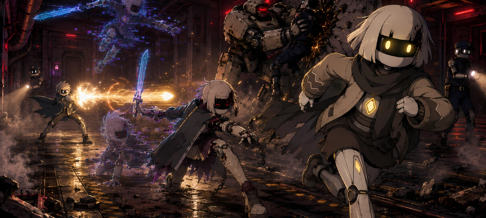
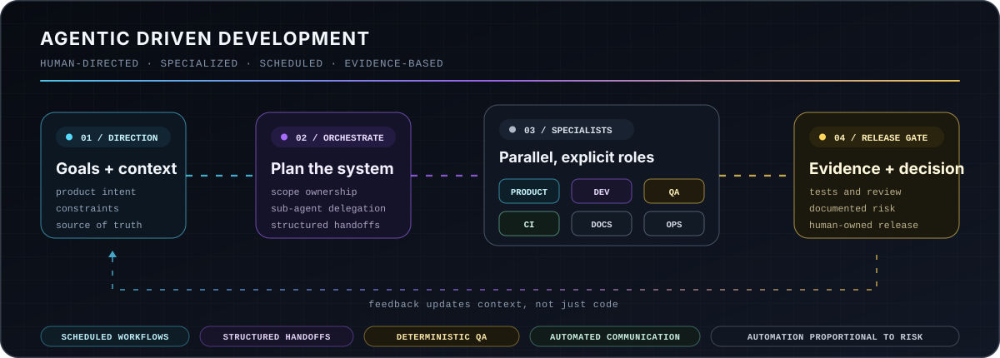

<!--
  KirilsTurkins/KirilsTurkins profile README
  Keep relative asset paths unchanged when uploading the repository.
-->

  

  <a href="#profile">Profile</a>
  &nbsp;·&nbsp;
  <a href="#systems">Current systems</a>
  &nbsp;·&nbsp;
  <a href="#agentic-development">Agentic development</a>
  &nbsp;·&nbsp;
  <a href="#stack">Stack</a>
  &nbsp;·&nbsp;
  <a href="#public-work">Public work</a>

  
  
  
  

## 01 / Profile

I am a dual Business Informatics student and software developer working where product thinking, architecture, implementation, and operations meet. I started programming at 12 and have since worked across scripting, full-stack products, automation, native clients, developer tooling, and game systems.

I prefer building **complete, understandable systems** rather than isolated features. A change should remain traceable from the user need through architecture, code, tests, documentation, deployment, and operation. The same principle shapes my game work: narrative and visual ideas must survive contact with gameplay, pacing, scene logic, animation, and engine constraints.

**What I focus on**

- Production web platforms with frontend, backend, data, authentication, administration, and operations designed together.
- Agentic engineering workflows with specialist roles, delegated sub-agents, structured handoffs, scheduled automation, and independent QA.
- Unity game architecture, narrative implementation, visual-development pipelines, reusable packages, and supporting web services.
- Delivery systems that are observable, reversible, documented, and proportional to the actual project risk.

> Most of my active engineering work lives in private repositories. The public repositories below are a selected cross-section rather than the complete footprint.

## 02 / Current systems

### DealRadar · private product

A production-oriented vehicle sourcing and decision platform for dealer workflows. The system spans listing acquisition, normalization, structured analysis, recommendations, multi-tenant accounts, administration, native packaging, deployment, observability, and role-specific documentation.

`Angular` · `TypeScript` · `Spring Boot` · `Java` · `PostgreSQL` · `Tauri` · `Rust` · `Docker` · `nginx`

### [SolutionWCMD](https://github.com/Solution-WCMD) · game universe

An original, story-driven 2D game universe where charm meets dread. My work across the project connects narrative design, playable scene implementation, Unity systems, visual development, shared tooling, web infrastructure, and production coordination.

`Unity 6` · `C#` · `URP 2D` · `Java` · `Angular` · `Narrative systems` · `Art pipelines`

  Original SolutionWCMD key art from the project visual-development library.

  <a href="https://github.com/Solution-WCMD"><strong>GitHub organization</strong></a>
  &nbsp;·&nbsp;
  <a href="https://www.solutionwcmd.com/"><strong>Project website</strong></a>
  &nbsp;·&nbsp;
  <a href="https://www.youtube.com/@SolutionWCMD"><strong>YouTube</strong></a>

## 03 / Agentic Driven Development

I use AI-assisted development as an **engineering operating model**, not as a single chat or autocomplete layer. Specialized agents receive explicit scope, repository context, ownership, constraints, and acceptance criteria. They can delegate bounded work to sub-agents, exchange structured handoffs, run on schedules, and move changes through review, CI, documentation, and release checks.

Human direction remains responsible for architecture, priorities, trade-offs, risk acceptance, and production decisions.

  

The practical techniques behind the model include:

- **Agent-to-agent delegation:** an orchestrator or specialist creates narrowly scoped sub-agents when parallel work or dedicated expertise improves the result.
- **Structured communication:** agents exchange repository artifacts, issues, pull requests, review notes, decision records, and explicit handoff summaries instead of relying on implicit session memory.
- **Scheduled workflows:** recurring development, repository hygiene, documentation, QA, and CI routines run automatically at defined times or events.
- **Independent verification:** feature creation and quality approval remain separate responsibilities, with deterministic checks and human-controlled release gates.

## 04 / Working stack

**Applications and data**

  
  
  
  
  
  

**Interactive and native systems**

  
  
  
  

**Delivery and operations**

  
  
  
  
  
  

**Engineering practices**

`System architecture` · `Agent orchestration` · `Automated QA` · `Release engineering` · `Documentation as code` · `Observability` · `Narrative implementation`

## 05 / Selected public work

| Repository | What it demonstrates | Main stack |
| --- | --- | --- |
| [Solution.Common](https://github.com/Solution-WCMD/SolutionWCMD-Common) | A reusable Unity foundation with shared utilities, patterns, abstractions, documentation, releases, and UPM installation. | C# · Unity |
| [Duke Recovery](https://github.com/Solution-WCMD/SolutionWCMD-DukeRecovery) | A keyboard-first, terminal-aesthetic puzzle game created for the Together Java Game Jam and designed to exist inside the Solution universe. | Java · Gradle · Swing |
| [SolutionWCMD Frontend](https://github.com/Solution-WCMD/SolutionWCMD-Frontend) | The public web presence and presentation layer for the SolutionWCMD universe. | Angular · TypeScript |
| [SolutionWCMD Email Microservice](https://github.com/Solution-WCMD/SolutionWCMD-EmailMicroservice) | A focused backend service supporting the project website and its communication flows. | Java · Backend services |

## 06 / Engineering principles

1. **Architecture should reduce future decisions, not create ceremony.**
2. **Automation should remove repeated effort while keeping responsibility visible.**
3. **QA, documentation, and operations belong inside development, not after it.**
4. **Release strictness should match project risk, team size, budget, and recovery options.**
5. **A narrative script is only successful when it also works as playable content.**

  

